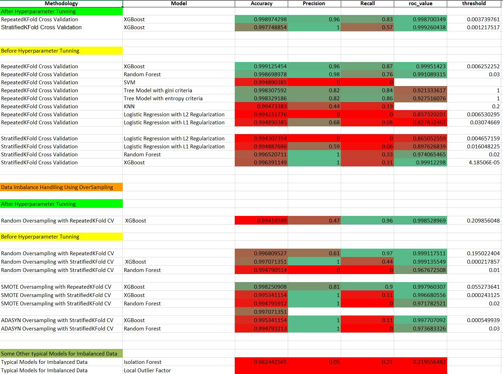
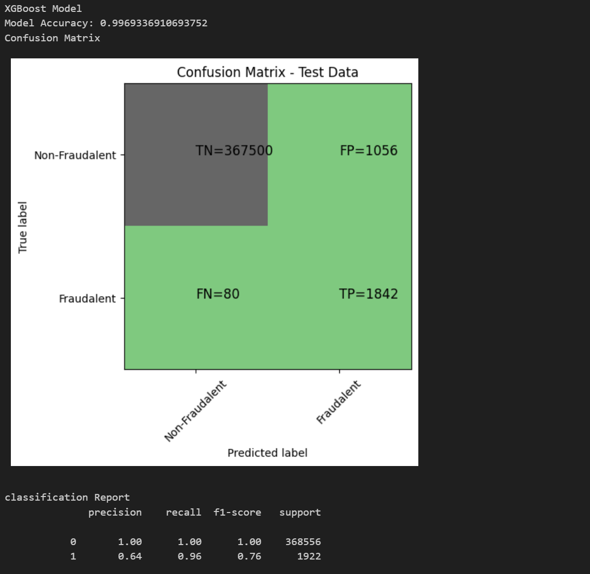
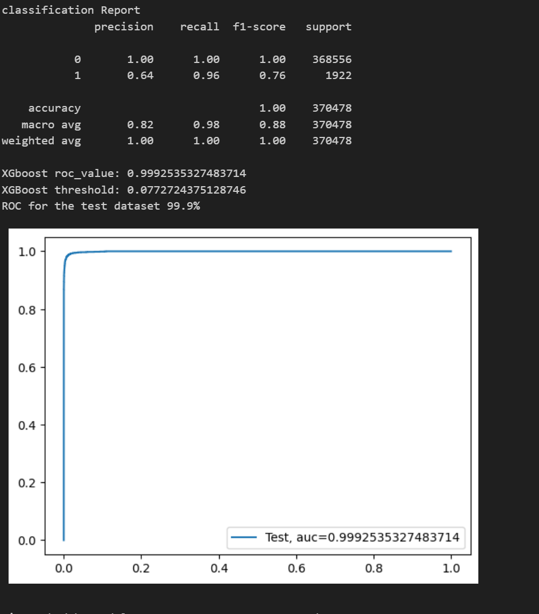
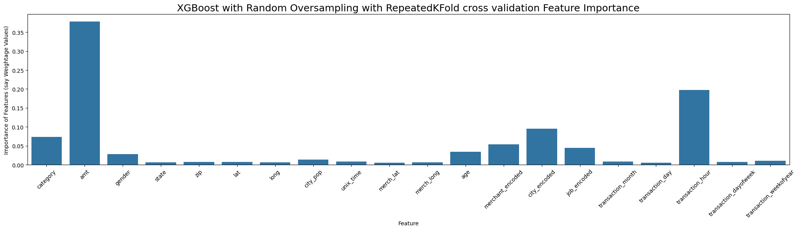
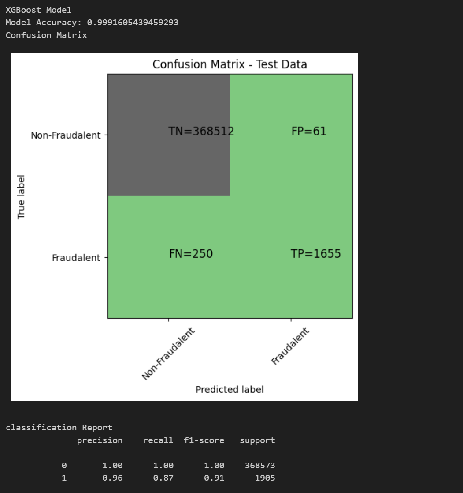
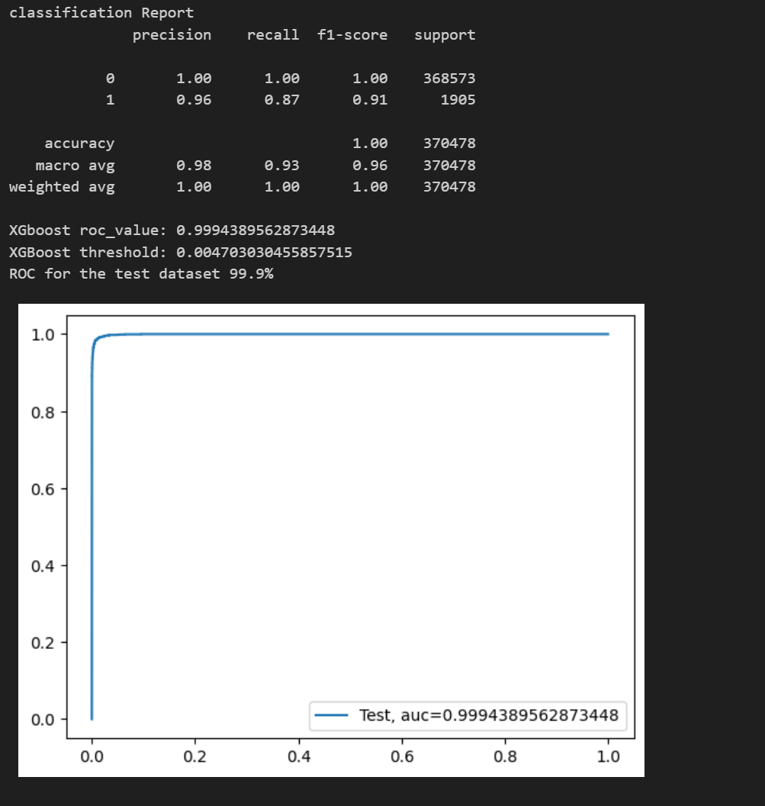
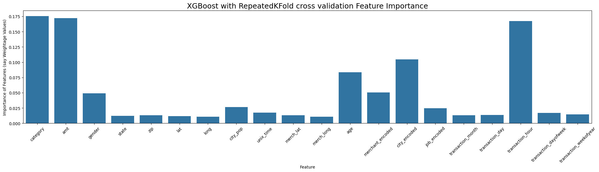

# Credit Card Fraud Detection project for the AFAME TECHNOLOGIES

## Detection of fraudulent credit card transactions

### Introduction About the Data
This is a simulated credit card transaction dataset containing legitimate and fraudulent transactions from the duration of January 1, 2019, to December 31, 2020. It covers credit cards of 1000 customers performing transactions with 800 merchants.

Dataset Link :
[https://drive.google.com/drive/folders/1sDzIPjCmNZ9lWaXfcAqIIx4NZchYG4OP]

### Project Objective

- Build a model to detect fraudulent credit card transactions.
- Experiment with various machine learning algorithms like Logistic Regression, Decision Trees, Random Forests, XGBoost, etc., to classify transactions as fraudulent or legitimate.
- Experiment with different sampling techniques to handle imbalanced data.

### Approach for the Project

#### Data Ingestion

1. **Loading the Data**: The dataset is loaded into a pandas DataFrame.
2. **Exploratory Data Analysis**: Basic visualizations and statistics are computed to understand the data.

#### Data Transformation

1. **Data Preparation:**
   
   - Cleaning the data
   - Handling missing values
   - Handling Categorical fetures
   - converting Categorical features into Numerical features using techniques like `one hot encoding` `target encoding` `label encoding`.
   - Feature engineering
   - Features Scaling / Normalization / Standardization.

#### Model Training, Prediction and Evaluation

1. **Model Selection**: Various machine learning models are defined including:
   - Logistic Regression
   - K-Nearest Neighbors (KNN)
   - Decision Trees
   - Random Forest
   - XGBoost
   - Support Vector Machine (SVM)
     
2. **Cross-Validation**: The models are trained using repeated KFolds / stratified k-fold cross-validation.
3. **Handling Imbalance using Oversampling Techniques**: Techniques like Random Oversampler, SMOTE Oversampler and ADASYN Oversampler are used to handle class imbalance.
4. **Model Training**: The models are trained using repeated KFolds / stratified k-fold cross-validation, for both with and without oversampling.
5. **Prediction**: The models are utilized to predict the classification of transactions.
6. **Model Evaluation**: The models are evaluated using metrics such as Confusion Matrix, ROC Curve, AUC, Precision-Recall Curve, and Classification Report.
7. **Hyperparameter Tuning**: GridSearchCV / RandomizedSearchCV are used for hyperparameter tuning.

Some Other typical Models for Imbalance data
  - Isolation Forest
  - Local Outlier Factor

#### Model Saving
**Model Saving**: The best performing models are saved using `joblib`.

#### Found Important Features:
Features `category`, `amt`(means transaction amount), `transaction_hour`, `age`, `gender`, `merchant_encoded`, and `city_encoded` have significant impact on the predictions of the fraud and legitimate transactions.

### Evaluation Metrics & Performances of different trained models

### Best Models
1. For Best Recall -->> `XGBOOST model with Random Oversampling with RepeatedKFold CV`

   - Accuracy:   0.996809527
   - Precision:  0.64
   - Recall:     0.96
   - ROC_AOC:    0.999117511
   - Threshold:  0.195022404193878
     
3. For Best in over all Good Precision and Descent Recall-->> `XGBOOST model with RepeatedKFold CV` without any oversampling

   - Accuracy:    0.999125454
   - Precision:   0.96
   - Recall:      0.87
   - ROC_AOC: 		0.99951423
   - Threshold: 	0.006252252
   
### ScreenShots of Evaluation Metrics & Performances of Best Models

##### XGBOOST model with Random Oversampling with RepeatedKFold CV

#####  `XGBOOST model with RepeatedKFold CV` without any oversampling

